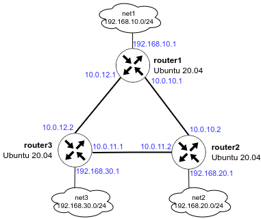

<h1>OSPF</h1>

<ol>
<li>Поднять три виртуалки</li>
<li>Объединить их разными vlan</li>
</ol>
 
<ul>
<li>Поднять OSPF между машинами</li>
<li>Изобразить ассиметричный роутинг</li>
<li>Сделать один из линков "дорогим", но что бы при этом роутинг был симметричным</li>
</ul>

<h3>Схема сети</h3>

 
<h3>Стенд</h3>

Vagrant mirror: https://vagrant.elab.pro 
Vagrant box: ubuntu/focal64 
Ansible playbook: net.yml  

  При настройке маршрутизации использован пакет frr. 
  Запрет ассиметричного роутинга отключается переменной sysctl <code>net.ipv4.conf.all.rp_filter=0</code>  
  Синхронность маршрута здесь управляется за счет изменения стоимости маршрутов на интерфейсах enp0s8 маршрутизаторов router1 и router2. 
  В Ansible для этого добавлена переменная symmetric_routing 

<h3>Асинхронный маршрут</h3>
На router1: 
<code>ping -I 192.168.10.1 192.168.20.1</code>
<pre>
PING 192.168.20.1 (192.168.20.1) from 192.168.10.1 : 56(84) bytes of data.
64 bytes from 192.168.20.1: icmp_seq=1 ttl=64 time=1.20 ms
64 bytes from 192.168.20.1: icmp_seq=2 ttl=64 time=2.09 ms
64 bytes from 192.168.20.1: icmp_seq=3 ttl=64 time=1.59 ms
64 bytes from 192.168.20.1: icmp_seq=4 ttl=64 time=0.911 ms
</pre>

На router2: 
<code>tcpdump -i enp0s9</code>
<pre>
12:59:47.691659 IP 192.168.10.1 > router2: ICMP echo request, id 1, seq 61, length 64
12:59:48.702291 IP 192.168.10.1 > router2: ICMP echo request, id 1, seq 62, length 64
12:59:49.723524 IP 192.168.10.1 > router2: ICMP echo request, id 1, seq 63, length 64
</pre>

<code>tcpdump -i enp0s8</code>
<pre>
12:59:52.739567 IP router2 > 192.168.10.1: ICMP echo reply, id 1, seq 66, length 64
12:59:53.746533 IP router2 > 192.168.10.1: ICMP echo reply, id 1, seq 67, length 64
12:59:54.748065 IP router2 > 192.168.10.1: ICMP echo reply, id 1, seq 68, length 64
</pre>

Ответы icmp возвращаются по другому более "дешевому" марщруту

<h3>Синхронный маршрут</h3>
На router2: 
<code>tcpdump -i enp0s9</code>
<pre>
13:11:33.404245 IP router2 > 192.168.10.1: ICMP echo reply, id 2, seq 22, length 64
13:11:34.406221 IP 192.168.10.1 > router2: ICMP echo request, id 2, seq 23, length 64
</pre>

Ответы icmp возвращаются по тому же марщруту, откуда был отправлен icmp запрос.

