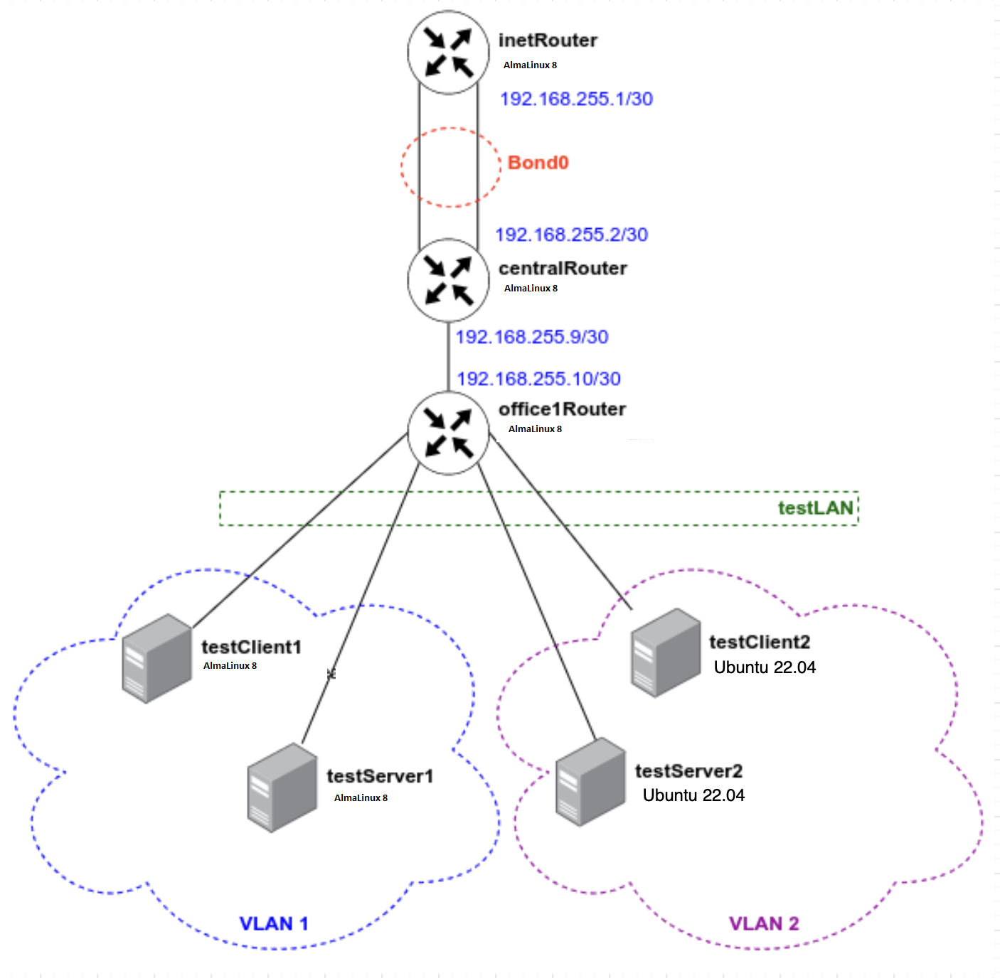

<h1>Сетевые пакеты. VLAN'ы. LACP</h1>

В Office1 в тестовой подсети появляется сервера с доп интерфейсами и адресами. 
В internal сети testLAN:

<ul>
    <li>testClient1 - 10.10.10.254</li>
    <li>testClient2 - 10.10.10.254</li>
    <li>testServer1- 10.10.10.1</li>
    <li>testServer2- 10.10.10.1</li>
</ul>

Равести вланами: 
testClient1 <-> testServer1 
testClient2 <-> testServer2

Между centralRouter и inetRouter "пробросить" 2 линка (общая inernal сеть) и объединить их в бонд, проверить работу c отключением интерфейсов

<h3>Схема сети</h3>

Vagrant boxes: almalinux/8, ubuntu/jammy64  
Ansible playbook: net.yml 

<h3>Настройка VLAN на RHEL-based системах</h3>

testClient1 , testServer1

<code>
vim /etc/sysconfig/network-scripts/ifcfg-vlan1 
systemctl restart NetworkManager
</code>

<pre>
[root@testServer1 vagrant]# ip a
1: lo: <LOOPBACK,UP,LOWER_UP> mtu 65536 qdisc noqueue state UNKNOWN group default qlen 1000
    link/loopback 00:00:00:00:00:00 brd 00:00:00:00:00:00
    inet 127.0.0.1/8 scope host lo
       valid_lft forever preferred_lft forever
    inet6 ::1/128 scope host
       valid_lft forever preferred_lft forever
2: eth0: <BROADCAST,MULTICAST,UP,LOWER_UP> mtu 1500 qdisc fq_codel state UP group default qlen 1000
    link/ether 08:00:27:4c:bd:69 brd ff:ff:ff:ff:ff:ff
    altname enp0s3
    inet 10.0.2.15/24 brd 10.0.2.255 scope global dynamic noprefixroute eth0
       valid_lft 86345sec preferred_lft 86345sec
    inet6 fd00::a00:27ff:fe4c:bd69/64 scope global dynamic noprefixroute
       valid_lft 86346sec preferred_lft 14346sec
    inet6 fe80::a00:27ff:fe4c:bd69/64 scope link noprefixroute
       valid_lft forever preferred_lft forever
3: eth1: <BROADCAST,MULTICAST,UP,LOWER_UP> mtu 1500 qdisc fq_codel state UP group default qlen 1000
    link/ether 08:00:27:ce:e3:b2 brd ff:ff:ff:ff:ff:ff
    altname enp0s8
    inet6 fe80::5e12:2cf7:4715:607a/64 scope link noprefixroute
       valid_lft forever preferred_lft forever
4: eth2: <BROADCAST,MULTICAST,UP,LOWER_UP> mtu 1500 qdisc fq_codel state UP group default qlen 1000
    link/ether 08:00:27:60:a7:0b brd ff:ff:ff:ff:ff:ff
    altname enp0s19
    inet 192.168.11.22/24 brd 192.168.11.255 scope global noprefixroute eth2
       valid_lft forever preferred_lft forever
    inet6 fe80::a00:27ff:fe60:a70b/64 scope link
       valid_lft forever preferred_lft forever
5: eth1.1@eth1: <BROADCAST,MULTICAST,UP,LOWER_UP> mtu 1500 qdisc noqueue state UP group default qlen 1000
    link/ether 08:00:27:ce:e3:b2 brd ff:ff:ff:ff:ff:ff
    inet 10.10.10.1/24 brd 10.10.10.255 scope global noprefixroute eth1.1
       valid_lft forever preferred_lft forever
    inet6 fe80::a00:27ff:fece:e3b2/64 scope link
       valid_lft forever preferred_lft forever
[root@testServer1 vagrant]# PING 10.10.10.254
bash: PING: command not found
[root@testServer1 vagrant]# ping 10.10.10.254
PING 10.10.10.254 (10.10.10.254) 56(84) bytes of data.
64 bytes from 10.10.10.254: icmp_seq=1 ttl=64 time=1.25 ms
64 bytes from 10.10.10.254: icmp_seq=2 ttl=64 time=0.466 ms
64 bytes from 10.10.10.254: icmp_seq=3 ttl=64 time=0.530 ms
</pre>

<h3>Настройка VLAN на Ubuntu</h3>

testClient2

<code>
vim /etc/netplan/50-cloud-init.yaml 
netplan apply
</code>
<pre>
root@testServer2:/home/vagrant# ip -br a
lo               UNKNOWN        127.0.0.1/8 ::1/128
enp0s3           UP             10.0.2.15/24 metric 100 fd00::44:a4ff:fe14:4581/64 fe80::44:a4ff:fe14:4581/64
enp0s8           UP             fe80::a00:27ff:fed8:8fe4/64
enp0s19          UP             192.168.11.32/24 fe80::a00:27ff:fe31:6911/64
vlan2@enp0s8     UP             10.10.10.1/24 fe80::a00:27ff:fed8:8fe4/64
</pre>

<pre>
root@testServer2:/home/vagrant# ping 10.10.10.254
PING 10.10.10.254 (10.10.10.254) 56(84) bytes of data.
64 bytes from 10.10.10.254: icmp_seq=1 ttl=64 time=0.904 ms
64 bytes from 10.10.10.254: icmp_seq=2 ttl=64 time=0.574 ms
</pre>

<h3>Настройка LACP между хостами inetRouter и centralRouter</h3>

centralRouter, inetRouter

<code>
[root@centralRouter vagrant]# vim /etc/sysconfig/network-scripts/ifcfg-eth1 
[root@centralRouter vagrant]# vim /etc/sysconfig/network-scripts/ifcfg-eth2 
[root@centralRouter vagrant]# vim /etc/sysconfig/network-scripts/ifcfg-bond0 
systemctl restart NetworkManager
</code>
<pre>
[root@inetRouter vagrant]# ping 192.168.255.2

PING 192.168.255.2 (192.168.255.2) 56(84) bytes of data.
64 bytes from 192.168.255.2: icmp_seq=1 ttl=64 time=2.18 ms
64 bytes from 192.168.255.2: icmp_seq=2 ttl=64 time=0.904 ms
64 bytes from 192.168.255.2: icmp_seq=3 ttl=64 time=0.588 ms
</pre>
<pre>
[root@centralRouter vagrant]# ip link set down eth1
[root@centralRouter vagrant]# ip link
1: lo: <LOOPBACK,UP,LOWER_UP> mtu 65536 qdisc noqueue state UNKNOWN mode DEFAULT group default qlen 1000
    link/loopback 00:00:00:00:00:00 brd 00:00:00:00:00:00
2: eth0: <BROADCAST,MULTICAST,UP,LOWER_UP> mtu 1500 qdisc fq_codel state UP mode DEFAULT group default qlen 1000
    link/ether 08:00:27:4c:bd:69 brd ff:ff:ff:ff:ff:ff
    altname enp0s3
3: eth1: <BROADCAST,MULTICAST,SLAVE> mtu 1500 qdisc fq_codel master bond0 state DOWN mode DEFAULT group default qlen 1000
    link/ether 08:00:27:ac:db:76 brd ff:ff:ff:ff:ff:ff
    altname enp0s8
4: eth2: <BROADCAST,MULTICAST,SLAVE,UP,LOWER_UP> mtu 1500 qdisc fq_codel master bond0 state UP mode DEFAULT group default qlen 1000
    link/ether 08:00:27:6b:12:28 brd ff:ff:ff:ff:ff:ff
    altname enp0s9
5: eth3: <BROADCAST,MULTICAST,UP,LOWER_UP> mtu 1500 qdisc fq_codel state UP mode DEFAULT group default qlen 1000
    link/ether 08:00:27:96:51:fd brd ff:ff:ff:ff:ff:ff
    altname enp0s17
6: eth4: <BROADCAST,MULTICAST,UP,LOWER_UP> mtu 1500 qdisc fq_codel state UP mode DEFAULT group default qlen 1000
    link/ether 08:00:27:c7:88:e7 brd ff:ff:ff:ff:ff:ff
    altname enp0s19
7: bond0: <BROADCAST,MULTICAST,MASTER,UP,LOWER_UP> mtu 1500 qdisc noqueue state UP mode DEFAULT group default qlen 1000
    link/ether 08:00:27:6b:12:28 brd ff:ff:ff:ff:ff:ff
</pre>
