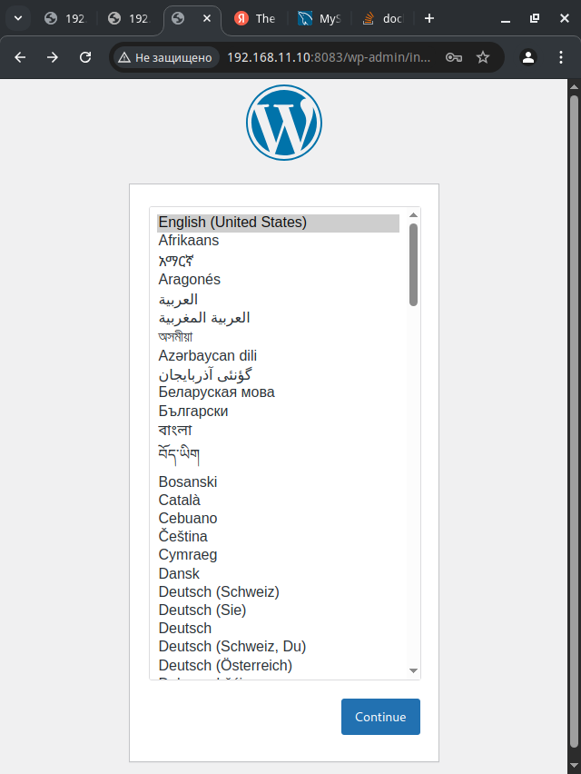
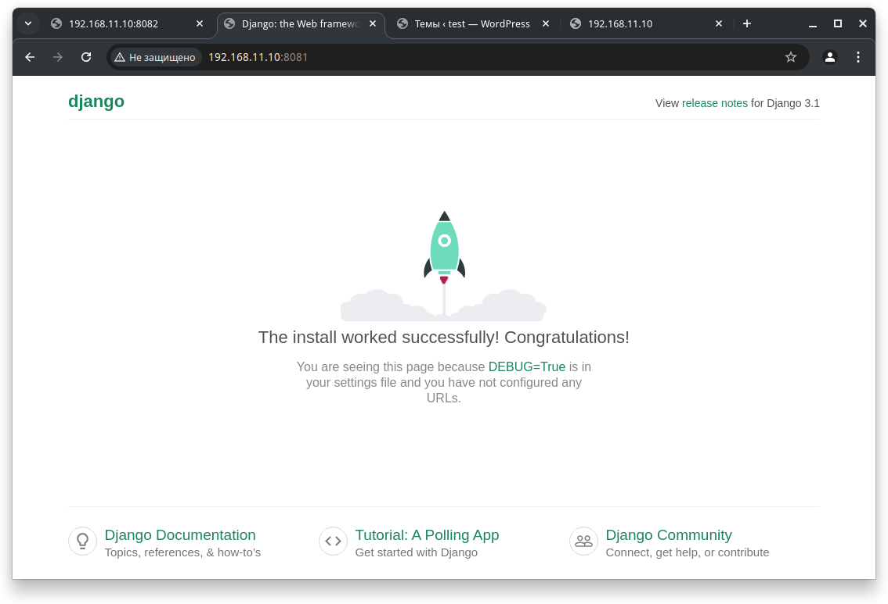
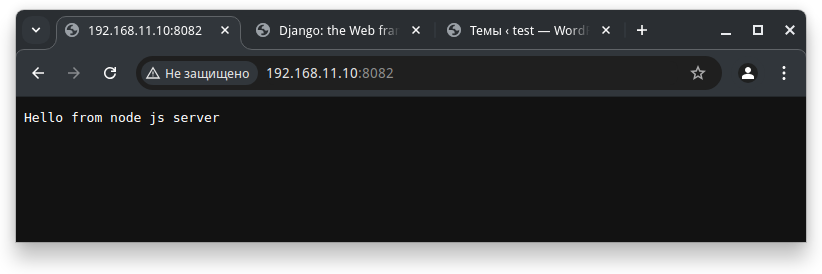

<h1>Развертывание веб приложения</h1>

Развернем стенд nginx + php-fpm (wordpress) + python (django) + js(node.js) с деплоем через docker-compose

  Vagrant mirror: https://vagrant.elab.pro 
  Vagrant box: ubuntu/20.04 
  Ansible playbook: web.yml

Порты виртуальной машины (8081-8083) проброшены на хост. На каждом порту в браузере должно открываться отдельное приложение.

<h3>Проверка приложения PHP/Wordpress</h3>
 
<h3>Проверка приложения Python/Django</h3>
 
<h3>Проверка приложения Node.js</h3>
 
